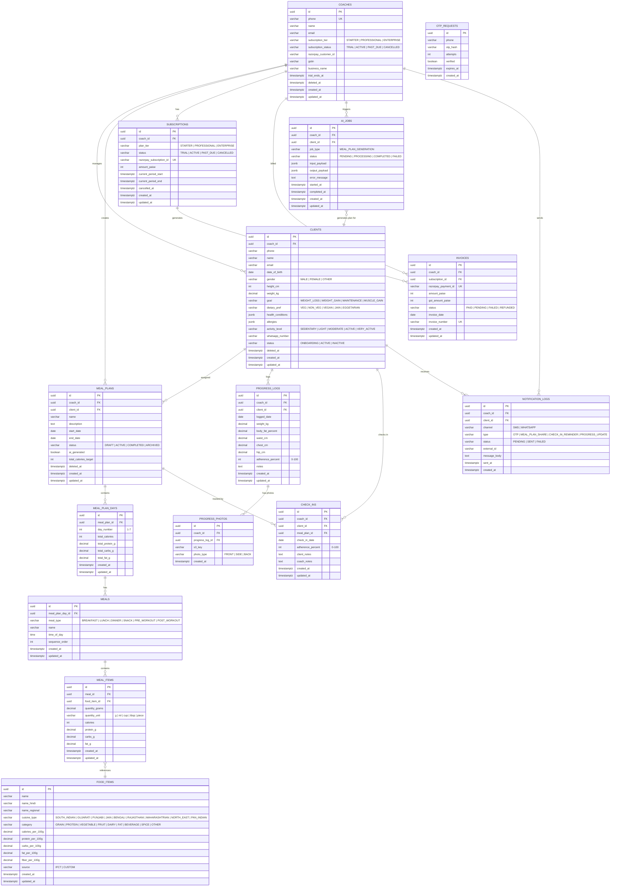

# NutriCoach — Database Design

## Principles

| Rule | Detail |
|---|---|
| **Multi-tenancy** | Every table has `coach_id UUID NOT NULL` — the tenant discriminator |
| **PKs** | UUID everywhere (PostgreSQL `gen_random_uuid()`) |
| **Migrations** | Liquibase XML only — never Flyway, never raw SQL files |
| **Hibernate** | `ddl-auto: validate` — Liquibase owns the schema |
| **Auditing** | `created_at`, `updated_at` on every table via JPA `@CreatedDate` / `@LastModifiedDate` |
| **Soft deletes** | `deleted_at` on client-facing tables (coaches, clients, meal_plans) |
| **Amounts** | Monetary values stored in **paise** (integer), never decimal |
| **Timestamps** | `TIMESTAMPTZ` (UTC) in DB, converted to `Instant` in Java |

---

## ERD



---

## Tables by Module

### `auth` module
| Table | Purpose |
|---|---|
| `otp_requests` | Phone OTP flow — hashed OTP, expiry, attempt counter |

### `coach` module
| Table | Purpose |
|---|---|
| `coaches` | Auth principal + tenant root. One row = one paying customer |

### `client` module
| Table | Purpose |
|---|---|
| `clients` | Coach's clients with dietary profile, goals, anthropometrics |

### `plans` module
| Table | Purpose |
|---|---|
| `meal_plans` | Top-level plan assigned to a client |
| `meal_plan_days` | Day breakdown (day 1–7 for weekly plans) with macro totals |
| `meals` | Individual meals (Breakfast, Lunch, etc.) within a day |
| `meal_items` | Food items within a meal with per-item macros |
| `food_items` | Indian food database (IFCT source) — shared, no `coach_id` |

### `progress` module
| Table | Purpose |
|---|---|
| `progress_logs` | Weight, body fat %, measurements per date |
| `progress_photos` | S3 keys for before/after photos, linked to a log entry |
| `check_ins` | Daily adherence tracking against an active meal plan |

### `billing` module
| Table | Purpose |
|---|---|
| `subscriptions` | Razorpay subscription lifecycle |
| `invoices` | Per-payment invoice with GST breakdown |

### `ai` module
| Table | Purpose |
|---|---|
| `ai_jobs` | Async GPT-4o job queue with input/output JSON payloads |

### `notifications` module
| Table | Purpose |
|---|---|
| `notification_logs` | Audit trail for every MSG91 OTP and WATI WhatsApp message |

---

## Index Strategy

```sql
-- coaches
CREATE UNIQUE INDEX ON coaches(phone);

-- clients
CREATE INDEX ON clients(coach_id);           -- tenant filter (all client queries)
CREATE INDEX ON clients(coach_id, status);   -- dashboard status filter

-- meal_plans
CREATE INDEX ON meal_plans(coach_id);
CREATE INDEX ON meal_plans(client_id);
CREATE INDEX ON meal_plans(coach_id, status);

-- progress_logs
CREATE INDEX ON progress_logs(client_id, logged_date DESC);

-- check_ins
CREATE INDEX ON check_ins(client_id, check_in_date DESC);

-- otp_requests
CREATE INDEX ON otp_requests(phone, created_at DESC);

-- ai_jobs
CREATE INDEX ON ai_jobs(coach_id, status);

-- food_items
CREATE INDEX ON food_items(cuisine_type);
CREATE INDEX ON food_items(category);
```

---

## Subscription Tiers & Feature Gates

| Feature | Starter ₹999 | Professional ₹2,499 | Enterprise ₹4,999 |
|---|---|---|---|
| Active clients | 10 | 50 | Unlimited |
| AI meal plans / month | 5 | 25 | Unlimited |
| Progress photos | No | Yes | Yes |
| WhatsApp reminders | No | Yes | Yes |
| Custom food items | No | Yes | Yes |
| White-label portal | No | No | Yes |

---

## Migration Order (Liquibase)

```
001-create-coaches.xml
002-create-clients.xml
003-create-meal-plans.xml
004-create-meal-plan-days-meals-items.xml
005-create-food-items.xml
006-create-progress-logs-photos.xml
007-create-check-ins.xml
008-create-subscriptions-invoices.xml
009-create-otp-requests.xml
010-create-ai-jobs.xml
011-create-notification-logs.xml
012-seed-food-items-ifct.xml
```

---

## Key Design Decisions

**Why no separate `users` table?**
Coaches are the only auth principals on the backend. Clients log in via a separate client portal (future) with their own lighter auth. Keeping them separate avoids a polymorphic users table and keeps tenant isolation trivial.

**Why `jsonb` for `health_conditions` and `allergies`?**
These are unstructured, coach-defined tags. No need to normalize until query patterns emerge. Postgres `jsonb` gives us indexability if needed later.

**Why `food_items` has no `coach_id`?**
It's a shared reference table (IFCT data). Coaches can add custom items — those will have a `coach_id` column added in a later migration (012+) to distinguish custom from global.

**Why store macros on `meal_items` redundantly?**
Denormalized for read performance — dashboard macro totals without joining `food_items` every time. Updated on write.
